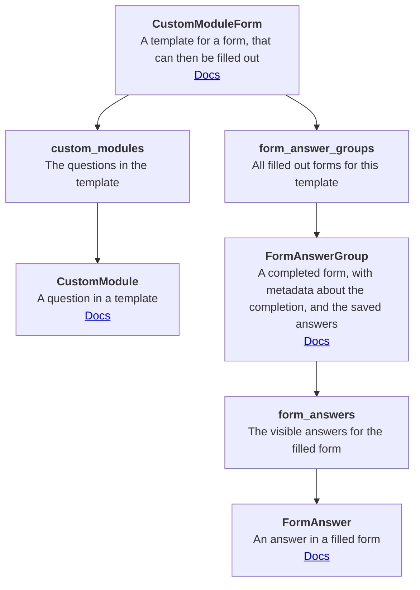

# Healthie API connection and management scripts

```mermaid
graph TD;
    CustomModuleForm["<b>CustomModuleForm</b><br/>A template for a form, that can then be filled out<br/><a href='https://docs.gethealthie.com/schema/custommoduleform.doc'>Docs</a>"];
    CustomModule["<b>CustomModule</b><br/>A question in a template<br/><a href='https://docs.gethealthie.com/schema/custommodule.doc'>Docs</a>"];
    custom_modules["<b>custom_modules</b><br/>The questions in the template"];
    form_answer_groups["<b>form_answer_groups</b><br/>All filled out forms for this template"];
    FormAnswerGroup["<b>FormAnswerGroup</b><br/>A completed form, with metadata about the completion, and the saved answers<br/><a href='https://docs.gethealthie.com/schema/formanswergroup.doc'>Docs</a>"];
    form_answers["<b>form_answers</b><br/>The visible answers for the filled form"];
    FormAnswer["<b>FormAnswer</b><br/>An answer in a filled form<br/><a href='https://docs.gethealthie.com/schema/formanswer.doc'>Docs</a>"];

    CustomModuleForm --> custom_modules;
    custom_modules --> CustomModule;
    CustomModuleForm --> form_answer_groups;
    form_answer_groups --> FormAnswerGroup;
    FormAnswerGroup --> form_answers;
    form_answers --> FormAnswer;

```
