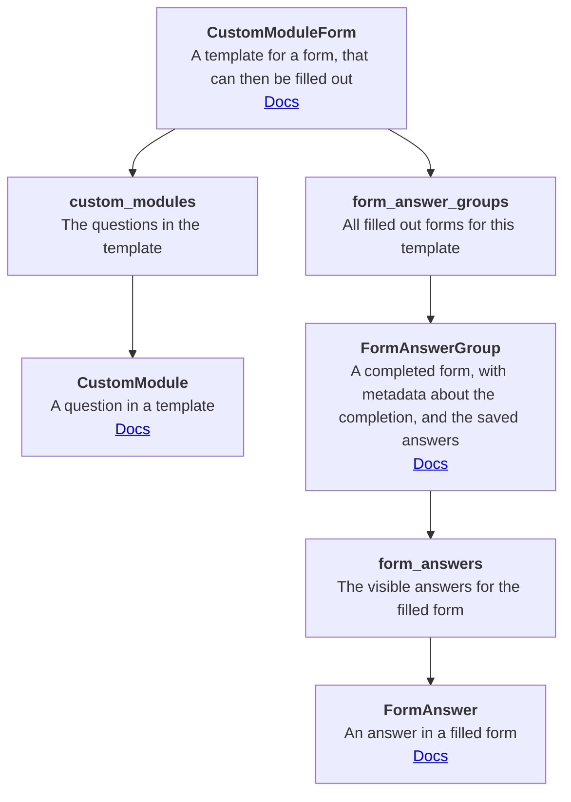

# Healthie API connection and management scripts

Package with functions connecting with Healthie's API and GraphQL


Objectives:
  - provides an interface to Healthie's API and endpoints
  - provides an interface to Syntrillo's iFrames displayed in Healthie extra tabs and panel items
  - provides HTML content to be delivered into Healthie iFrames (currently the SyntrilloPythonAnywhere web-server app)
  - includes the logic to all Healthie's related events

## Environment files

Include api keys generated in Healthie > Settings

These files are local files, not stored in the repository.

```
API_KEY='xxxx'
ORGANIZATION='staging'  # 'staging' or 'production'
```

### Accounts :

staging account, organization id 57057

production/enterprise account, organization id 8387


## CustomModuleForm graph


